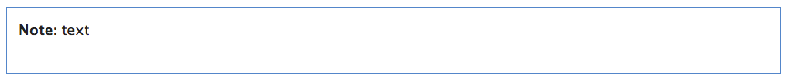

notebox-octopress
=================

 

#How to Use


text


#Install

1.Copy *notebox.rb* file into your *octopress/plugins*

2.Copy codes at bottom of your *octopresssass/custom/_stype.scss* file.


.notebox {
  border:1px;
  border-style: solid;
  border-color: #5088C5;
  background-color:#fff;
  margin:.75em 0 1.5em;
  padding:.75em .667em .75em .750em;
  text-align:left;
}


